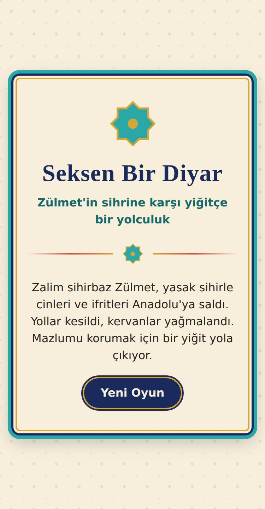
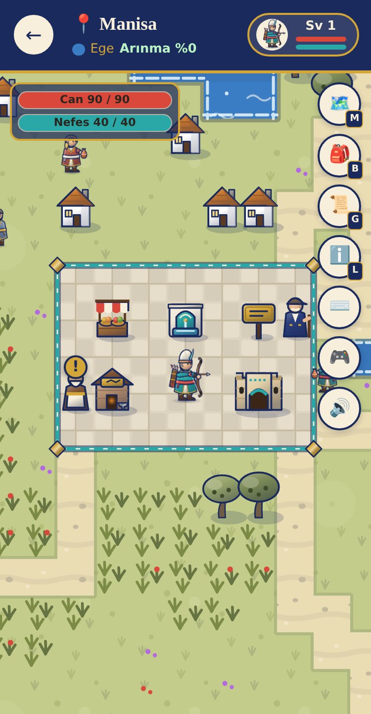
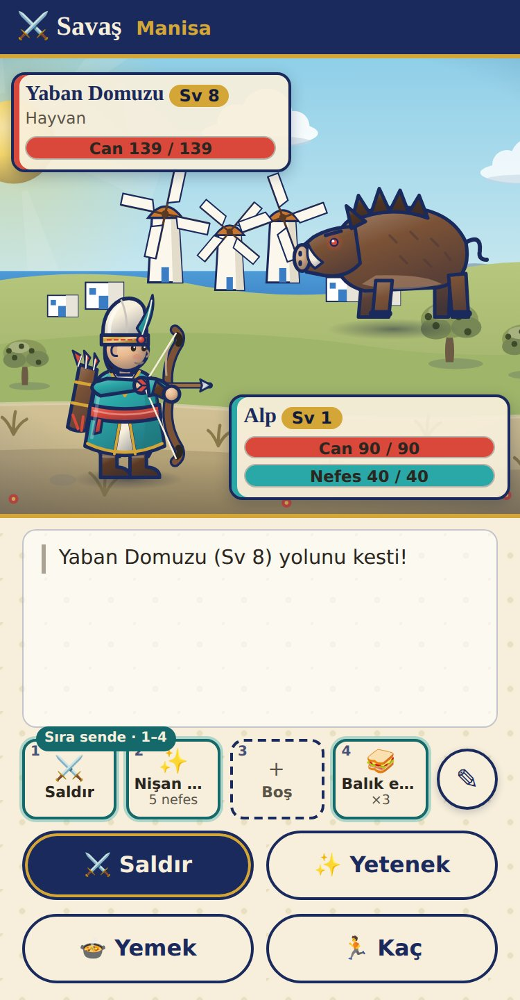
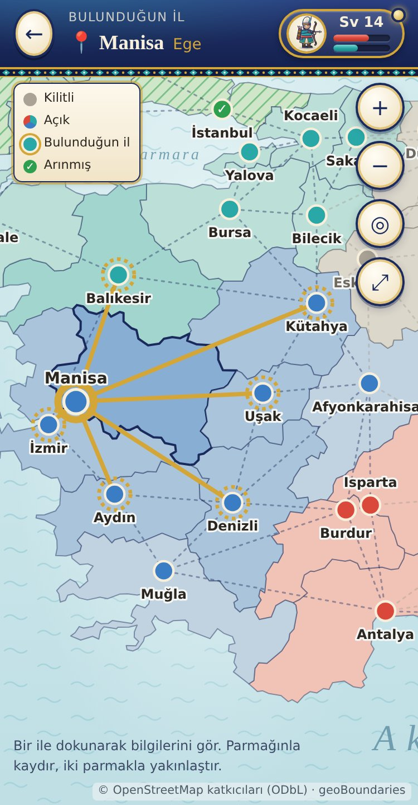
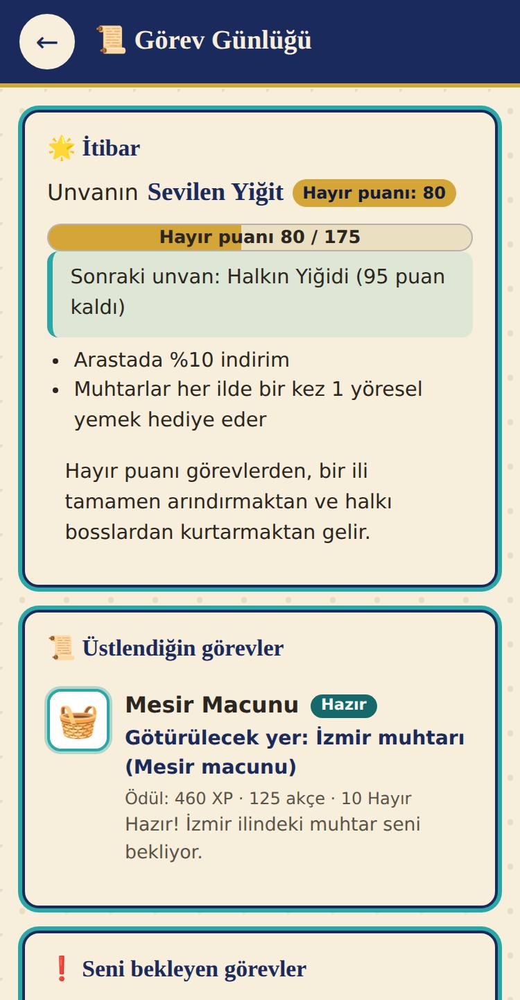

# Seksen Bir Diyar

Türkiye'nin 81 ilinde geçen, tarayıcıda oynanan, sıra tabanlı bir RPG. Oyuncu, genç yiğit **Alp** olarak illeri gezer, zalim sihirbaz **Zülmet**'in saldığı cinleri ve ifritleri yener, seviye atlar ve yurdu kötülükten arındırır. Her ilin yöresel yemeği, can ve nefes yenileyen birer azıktır.

**Oyna:** <https://mdtokat.github.io/seksen-1-diyar/>

Telefonda dikey ekranda rahat oynanır; masaüstünde de çalışır. İlerleme tarayıcıda otomatik kaydedilir.

## Ekran görüntüleri

| Başlık | İl içi gezinti | Savaş |
|---|---|---|
|  |  |  |

| Türkiye haritası | Görev günlüğü |
|---|---|
|  |  |

## Oyun rehberi

### Başlangıç
Adını gir ve üç yoldan birini seç:

- **Akıncı:** kılıçlı öncü süvari. Canı ve savunması yüksektir; *Yiğit Nârası* ile gücünü artırır.
- **Kemankeş:** Osmanlı okçusu. Çevik ve isabetlidir, kritik vuruşları güçlüdür; canı azdır, dikkatli oyna.
- **Alperen:** gazi-derviş geleneğinden gelir. Nefesi boldur, kendini iyileştirir; *Arınma Işığı* cinlere ve ifritlere ek hasar verir.

Yolculuk İstanbul'da başlar. Başlangıçta yalnızca Marmara açıktır.

### Gezinti
- Gitmek istediğin yere **dokun** ya da ekrandaki **yön tuşlarını** (🎮) kullan. Masaüstünde **ok tuşları** ve **WASD** çalışır.
- İl meydanı güvenlidir; düşmanlar giremez. Meydanda **çeşme**, **arasta** (yemek tezgâhı), **tabela** (il bilgisi) ve **muhtar** bulunur. Bazı illerde **Ahi esnafı**, **Ahi Baba** ve **kervansaray** da vardır.
- Haritanın kenarındaki yollar komşu illere çıkar. Kilitli bölgeye giden yol mor bir sihirli engelle kapalıdır.
- Sağdaki düğmeler: 🗺️ Türkiye haritası · 🎒 heybe · 📜 görev günlüğü ve başarımlar · ℹ️ il bilgisi · ⌨️ klavye kısayolları · 🎮 yön tuşları · 🔊 ses.
- Sol üstteki gösterge **can** ve **nefesini** savaş dışında da gösterir; can azalınca kırmızı yanıp söner.
- **Klavye kısayolları:** `M` harita · `B` heybe (çanta) · `K` karakter · `G` görev günlüğü · `L` il bilgisi · `?` kısayol listesi. Açık ekranın tuşuna yeniden basınca gezintiye dönülür; `Esc` geri götürür.
- **İller gerçek boyutlarıyla orantılıdır:** il haritasının büyüklüğü yüzölçümüyle, en-boy oranı ilin şekliyle belirlenir. Konya en geniş, Yalova en küçük haritadır. Evler ve meydanda dolaşan halk nüfusla artar; İstanbul en kalabalık ildir. İl bilgisinde ve Türkiye haritasındaki il kartında yüzölçümü, nüfus ve sıralamaları görünür.

### Savaş
- Düşmanlar haritada dolaşır; yaklaşınca peşine düşer, temas edince sıra tabanlı savaş başlar. Büyük illerde daha çok düşman olur.
- **Takipçi düşmanlar** (👣 rozetli: kurtlar, çakallar, yol kesen cinler…) seni uzaktan fark eder, neredeyse senin kadar hızlı koşar ve kolay kolay peşini bırakmaz. Kurtulmak için meydana sığın, başka ile geç ya da savaş. Savaşta bunlardan kaçmak da daha zordur.
- Her turda **Saldır**, **Yetenek** (nefes harcar), **Yemek** ya da **Kaç** seçilir. İnlerindeki bosslardan kaçılamaz; gezgin bosslardan kaçılabilir.
- **Kısayol yuvaları:** savaş ekranındaki dört yuva, sıra sendeyken `1` `2` `3` `4` tuşlarıyla ya da dokunarak kullanılır. Yuvalara yetenek, yemek, Saldır ya da Kaç konur (✎ düğmesi ya da karakter ekranındaki *Savaş Kısayolları*). Yeni açılan yetenekler boş yuvalara kendiliğinden yerleşir.
- Zafer XP, akçe ve bazen ilin yöresel yemeğini getirir; ayrıca ili **%12–18 arındırır**. %100 olan il yeşile döner.
- Bayılırsan en son dinlendiğin kervansarayda (hiç dinlenmediysen bulunduğun ilin meydanında) kendine gelirsin ve akçenin %10'unu kaybedersin.

### Seviye ve ekipman
- Her seviyede statların kendiliğinden artar ve **3 stat puanı** dağıtırsın (👤 karakter ekranı). Yeni yetenekler 5, 12, 20 ve 32. seviyelerde açılır.
- **Ahi esnafı** bölgenin sıradan ve nadir silah, zırh ve kuşaklarından altısını sergiler; eşyalarını yarı fiyatına geri alır. Tezgâh her 4 zaferde başka mallarla dolar ve aynı bölgedeki her dükkânın tezgâhı ayrıdır; her sınıf için silah ve bir zırh ya da kuşak her zaman bulunur. **Efsanevi** eşyaları bosslar düşürür.
- **Seyyar tüccar** yollarda dolaşır: ile girerken haritada bekliyor olabilir ya da yürürken yakınlarda belirir (🛍️). Sınıfına uygun **güçlü** mallar satar — bölgenin efsanevi eşyaları ve bir sonraki bölgenin eşyaları — ama yol masrafı yüzünden %50 pahalıdır; bir süre sonra yoluna devam eder.

### Yemekler
Her ilin meşhur yemeği ya **canı** (ana yemekler) ya da **nefesi** (tatlılar, içecekler, meyveler, bal) yeniler. Doğuya gidildikçe yemekler güçlenir. Heybe 20 yuvadır; aynı yemekten bir yuvada 10 tane durur.

### Bölgeler ve bosslar
Bölgeler sırayla açılır: Marmara → Ege → Akdeniz → İç Anadolu → Karadeniz → Güneydoğu → Doğu Anadolu. Her bölgenin bossu, bölge illerinin ortalama arınması %60'a ve seviyen bölgenin üst seviyesinin bir altına ulaşınca mühründen çıkar. Boss yenilince sonraki bölge açılır ve **zafer sofrası** kurulur (10 savaş boyunca %10 güç). Bazı illerde arınma %50'yi geçince **mini boss** belirir.

### Gezgin ve sürpriz bosslar
Bölgenin boss yaratıkları (mini bosslar ve bölge bossları) inlerinin dışında da çıkar: haritada sıradan düşmanlar arasında **gezgin boss** olarak dolaşabilir, yürürken de hiç beklemediğin bir anda **sürpriz** olarak yanı başında belirebilirler (meydan güvenlidir). Güçleri karaktere göre değil, bulundukları ile göre belirlenir: seviyeleri ilin düşman seviyesinin üst ucundan başlar, yani o ilin sıradan düşmanlarından hep güçlüdürler:

- **⚔️ Zorlu:** ilin düşmanlarından güçlüdür ama kesilebilir; iyi dövüşür, yeteneklerini ve yemeklerini kullanırsan yenersin. Bol XP, akçe ve bazen bölgenin nadir eşyalarından birini düşürür.
- **💀 Kesilemez:** zırhı kılıcını söndürür; o ilin seviyesindeysen yenmek pek mümkün değildir (ilin çok üstüne çıkmış bir yiğit ise kesebilir). **Kaç!** Gezgin bosslardan (bölge bossu türünden olsalar bile) kaçılabilir.

Gezgin bosslar ilerlemeyi etkilemez: yenmek bölge bossunu ya da mini bossu yenilmiş saydırmaz.

### Kervansaray ve hızlı yolculuk
Kervansarayda dinlenmek ücretsizdir; can ve nefes dolar. Tamamen arınmış illerdeki kervansaraylar arasında akçe karşılığı anında yolculuk edebilirsin.

### Görevler ve itibar
Meydanlardaki **muhtarlar** ve **Ahi Babalar** görev verir (başlarındaki `!` işareti). Görevler: belirli bir düşmandan birkaç tane yenmek, bir ili arındırmak ya da bir yöresel yemeği komşu ile ulaştırmak. Görevler ve mazluma yardım (ili arındırmak, bossları yenmek) **Hayır puanı** kazandırır. Unvanın yükseldikçe arastada indirim alırsın; muhtarlar da köylüler adına hediye yemek verir (🎁).

### Final
Van Gölü Canavarı'nı yenip **seviye 48**'e ulaşınca Ağrı Dağı'ndaki kalenin mührü çözülür. Zülmet ile **üç evreli** bir savaş seni bekler: canı azaldıkça yeni sihirlerle güçlenir. Onu yenince hikâyenin sonunu ve 81 ilin özetini görürsün; ardından kalan illeri arındırmaya devam edebilirsin.

### Başarımlar
İlk Zafer, İlk İl Arındı, Bir Bölge Tamam, Yiğit (bir bölge bossunu o bölgede hiç bayılmadan yenmek), Efsanenin Sahibi, Halkın Yiğidi, Hizmet Ehli, Sofra Ustası (81 yemeğin hepsini toplamak), Zulmete Son ve 81 Diyar. Hepsi görev günlüğündedir.

### İpuçları
- Savaştan önce heybeni bölgenin yemekleriyle doldur; bosslarda canın yarıya inmeden ye.
- Stat puanlarını dağıtmayı unutma; üst çubuktaki karakter düğmesinde nokta varsa bekleyen puanın var demektir.
- Kemankeş ile canı, Alperen ile nefesi göz ardı etme.

## Geliştirme

Geliştirme planı, kurallar ve faz takibi için: [plan.md](plan.md)

### Gereksinimler

- Node.js 20.19+ veya 22.12+
- npm

### Kurulum ve çalıştırma

```bash
npm install      # bağımlılıkları kur
npm run dev      # geliştirme sunucusunu başlat (http://localhost:5173)
npm run test     # testleri çalıştır
npm run build    # yayın paketini dist/ klasörüne derle
npm run preview  # derlenmiş paketi yerelde önizle
```

### Yayın

`main` dalına yapılan her push, GitHub Actions ile test edilip derlenir ve GitHub Pages'e yayınlanır (`.github/workflows/deploy.yml`): <https://mdtokat.github.io/seksen-1-diyar/>. Depo ayarlarında **Settings → Pages → Source** değeri **GitHub Actions** olmalıdır.

### Teknoloji

Vite, vanilla JavaScript (ES modülleri), Vitest, SVG, Web Audio API ve localStorage. Görseller ve sesler koddan üretilir; harici görsel ya da ses dosyası yoktur.

## Harita verisi ve atıf

İl sınırları © [OpenStreetMap](https://www.openstreetmap.org/copyright) katkıcıları (ODbL) verisinden, [geoBoundaries](https://www.geoboundaries.org) (gbOpen TUR ADM1) aracılığıyla alınmış ve sadeleştirilmiştir (`src/veri/ilSinirlari.js`). Atıf, oyunun haritasında da gösterilir.
